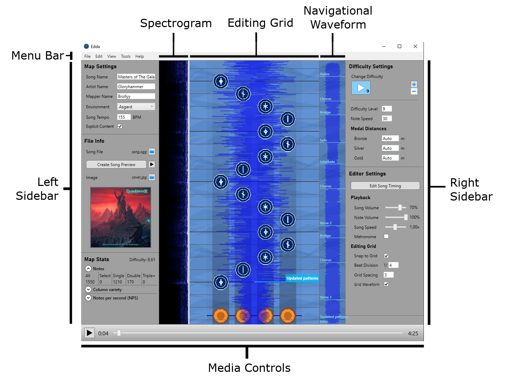
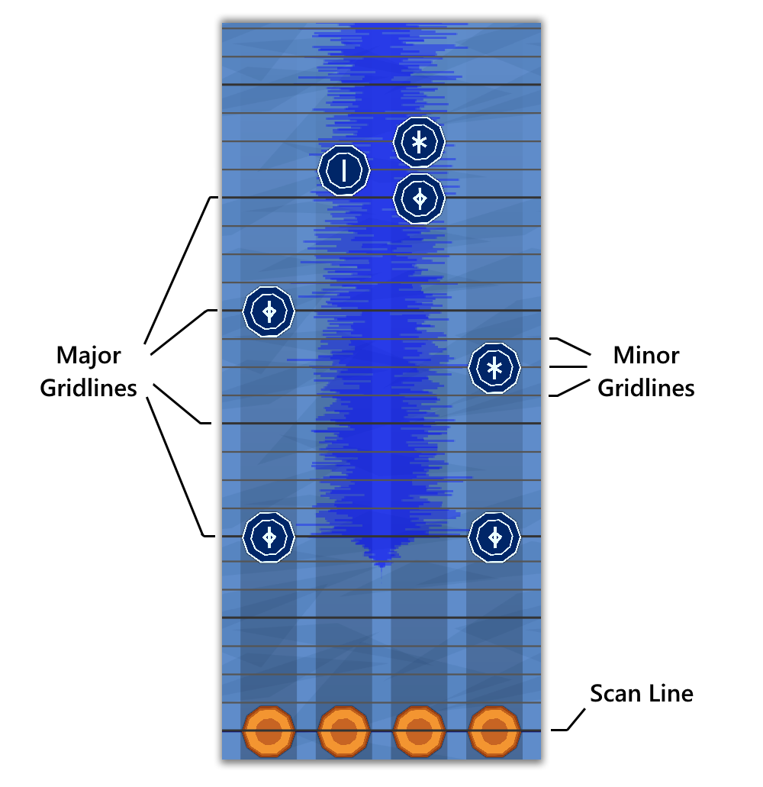

---
---
# Using Edda

> **NOTE**: This guide is up to date as of Edda v0.4.0b4.

Now that you have Edda installed and a song file ready to go, let's make a map!

Go to the folder you extracted Edda to, and open `Edda.exe`.  

This is what Edda's UI looks like.

Let's have a closer look at the editing grid, since we'll be working with it a lot.

The scan line is marked by four drums. This represents your current position in the song (consistent with the slider in the media controls). When you play back your map, it will start from the scan line. 

The editing grid contains many gridlines - these are where you'll be placing your notes.

The darker gridlines are called major gridlines. These gridlines represent the start of a beat in the song.

The space between the major gridlines are divided up into sub-beats by minor gridlines. 

For most of this grid, the beats (major gridlines) are divided into four sub-beats.  
We call this a *Grid Division* of 4 (or 1/4), which you can specify in the right sidebar.

> **NOTE**: If you know the song's time signature, the *Grid Division* will be the bottom number.  
> e.g. a 3/4 time signature corresponds to a grid division of 4.

The *Grid Spacing* is a multiplier that affects the space between gridlines.  
This can also be found in the right sidebar. The default value is 1, but you can increase this if the gridlines are too cramped, or lower it if you want to fit more of the map on the editing grid. 

## Creating a map

Click the "New Map" button in the toolbar.

Select a folder to store your map in. Ragnarock uses the directory `Documents/Ragnarock/CustomSongs`, so a good starting point is to create a folder in there and use it.

Select the `.ogg` Vorbis file you want to map.

Your map is now set up and ready to edit!

## Setting up song timing

### Finding the song BPM

Let's find out the BPM of our song.

Click the "BPM Finder" button at the top of Edda's main window.

Play the song in Edda, then bring up the BPM finder window and tap any key to the beat.

Once you feel that you've tapped enough beats, look at the average BPM displayed and put it in the *Song BPM* under the left sidebar of the main window (you might want to round it to the nearest integer).

### Aligning the song

Edda assumes the start of the song file is the first beat, but most song files don't begin exactly on a beat.

There are two ways we can resolve this issue. 

The first is to trim the song file beforehand using something like Audacity or [Arrow Vortex](http://arrowvortex.ddrnl.com). This can be tedious to do.  

The second solution is to place a BPM change at the start of the first beat in the song. This is a lot easier, so let's go through this.  

First, we need to find the *Global Beat* that the song's first beat begins on.

Using the editing grid, find the start of the song's first beat with the mouse. The global beat corresponding to the mouse location will be shown in the timing bar - you'll want to use the unsnapped value in the brackets.  

It may be helpful to turn on the *Big Waveform* in the right sidebar, so you can visually find the start of the first beat.

Once you know the global beat, we can now specify a BPM change.  
 
In the left sidebar, click the ellipsis (`...`) next to *Song BPM*. A new window will pop up.

Double-click the blank entry in the BPM Changes table to add a new BPM change.

Enter the global beat you found previously, and set the *BPM* and *Grid Division* fields to the *Song BPM* (left sidebar) and *Grid Division* (right sidebar) fields, respectively. Press the Enter key to apply your changes. 

### Checking the song's timing

Your song should be ready to map now, but let's check that the timing is correct.

Place some notes on the major gridlines by left-clicking. Now play them back using the Play/Pause button in the media controls (or by pressing space).

Do the drum notes sound synchronised with the music?

Be sure to check both at the start *and* at the end of your song:

- If you've made an error placing the BPM change at the start of your song, it will become obvious there.

- If you've made an error specifing the *Song BPM*, it will be easiest to find out at the end of the song - that's where all the BPM errors will accumulate.

Make sure your timing is as close to perfect as possible before you move on: you don't want to come back after placing thousands of notes to find that there's a mistake with the timing.  

> **NOTE**: If you are having audio sync issues, check out the page on [Audio Latency](...).

## Setting up map info

Before we start placing notes, we need to fill out some details about our map.

### Map Settings and metadata

In the left sidebar under **Map Settings**, fill out the *Song Name*, *Artist Name* and *Mapper*.   

Choose an *Environment* for your song - this is the world your boat will row in when you play the song in-game.  

Under **File Info**, click the ellipsis (`...`) next to the *Image* field. Choose a cover image for your map - this will be displayed in-game.  

> **NOTE**: If you want to change the song file in your map, select the ellipsis next to *Song File*, under **File Info**.

### Song Preview (optional)

The preview is what plays in-game when you select a song. It should be shorter than 15 seconds and it should showcase the best part of your song, for example the chorus.

You don't need a preview for your song to be playable, but it's a good idea to have one. If you like, you can come back and do this after some mapping.

Now let's create a preview.

Using the media controls in the bottom of Edda's main window, pick out the start and end times of what you want the preview to be.

Now under **File Info**, click the "Create Preview" button. Put in your start and end times, add a fade out duration (if you wish) and then click "Create Preview".

A console will pop up. Once it closes, you can find the finished result in your map folder with the filename `preview.ogg`.

### Difficulty Settings

The **Difficulty Settings** are located in the right sidebar.

Ragnarock maps come with up to three difficulties, indicated by 1-3 stacked triangles (more triangles means higher relative difficulty).

You can add or delete difficulties using the respective buttons.  

You can switch to another difficulty by clicking on the large buttons with icons in them. The button that is disabled (greyed out) is the difficulty you have currently selected.  

You don't have to worry about manually sorting difficulties - Edda will take care of it for you.

___

Each difficulty has a *Difficulty Level*, *Note Speed*, and **Medal Distances**.

The *Difficulty Level* is a number from 1 to 10 (inclusive) that represents how hard the map is. You should be familiar with this number if you've played Ragnarock before.

The *Note Speed* is how fast the runes approach you when you play the map in-game. It's hard to tell how fast a certain note speed really is, so you'll have to experiment with this in the game. A good place to start is 15, which represents an average or average-fast speed. You can increase this a few units to make the notes approach even faster.

Medal Distances represent how many metres your boat must row in order to achieve a certain medal. If you leave these set to 0, Ragnarock will automatically calculate medal distances for you.  
